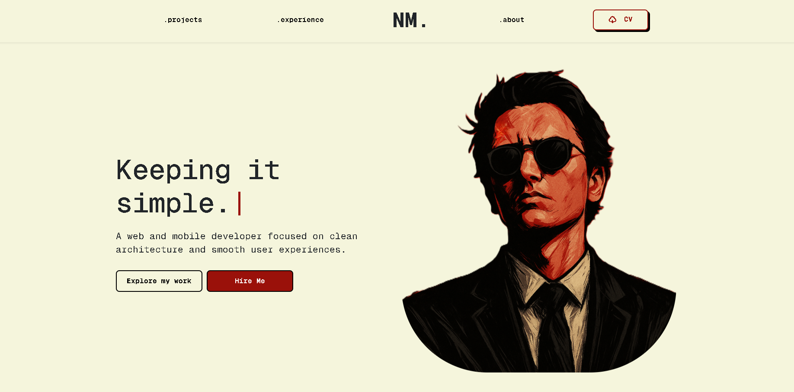
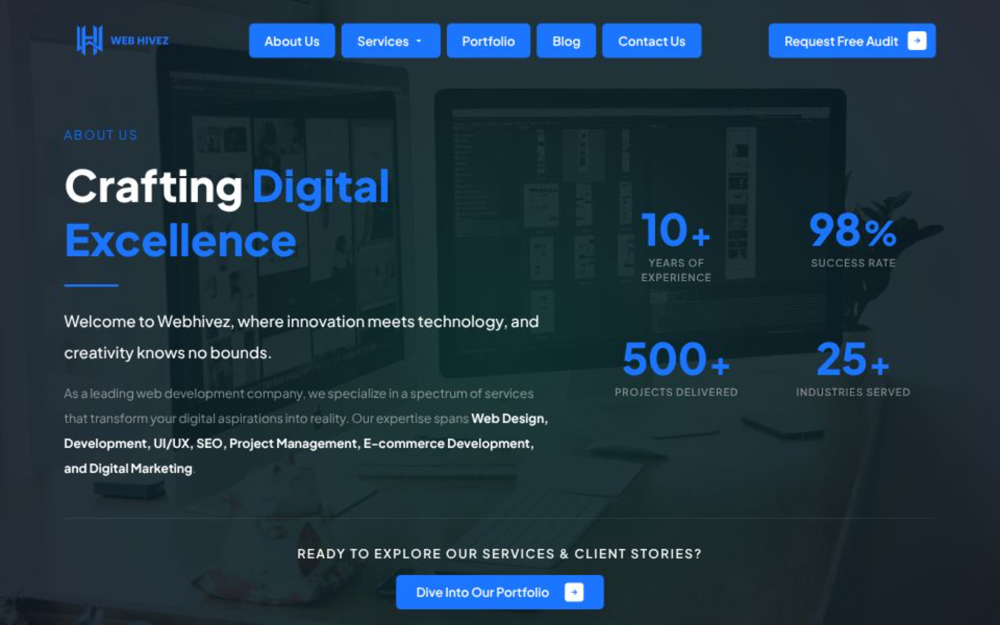
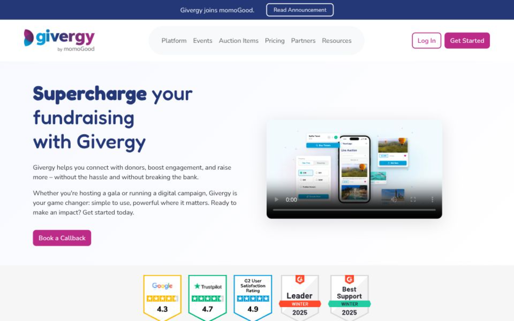
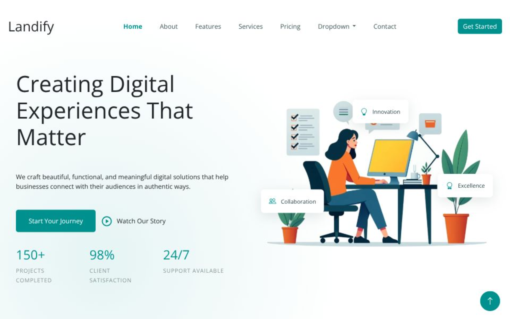
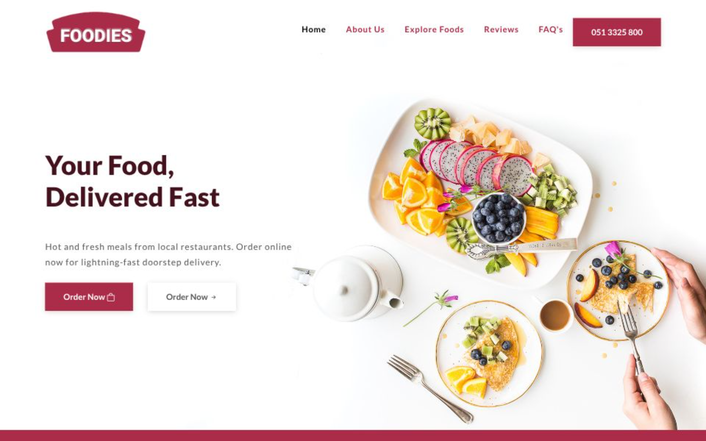

  

---

This space serves is where all of my practiced topics, core concepts, and weekly hands-on exercises are structured and preserved. Inside, you will find practical implementations of fundamental web technologies and frameworks built throughout the internship.

## Projects

A collection of hands-on projects built during this internship — from personal portfolios to full website clones.

<table>
  <tr>
    <td align="center" width="50%">
        
      <b>Nousher's Portfolio</b> 
      A personal portfolio site showcasing skills and work.  
      <a href="https://web-hivez.vercel.app"><b>View Project →</b></a>
    </td>
    <td align="center" width="50%">
        
      <b>Webhivez About</b> 
      A redesign of webhivez about page  
      <a href="https://webhivez.com/about-us/"><b>Old Design | </b></a>
      <a href="https://web-hivez-about.vercel.app"><b>New Design</b></a>
    </td>
    
  </tr>
  <tr>
  <td align="center" width="50%">
        
      <b>Givergy Website</b> 
      A front-end of the Givergy website.  
      <a href="https://givergy.vercel.app"><b>View Project →</b></a>
    </td>
    <td align="center" width="50%">
        
      <b>Landify Website</b> 
      A front-end of the Landify website.  
      <a href="https://landify-phi-inky.vercel.app"><b>View Project →</b></a>
    </td>
  </tr>
  <tr>
    <td align="center" width="50%">
        
      <b>Foodies Website</b> 
      A front-end of the Foodies website.  
      <a href="https://foodies-taupe-theta.vercel.app"><b>View Project →</b></a>
    </td>
  </tr>
</table>